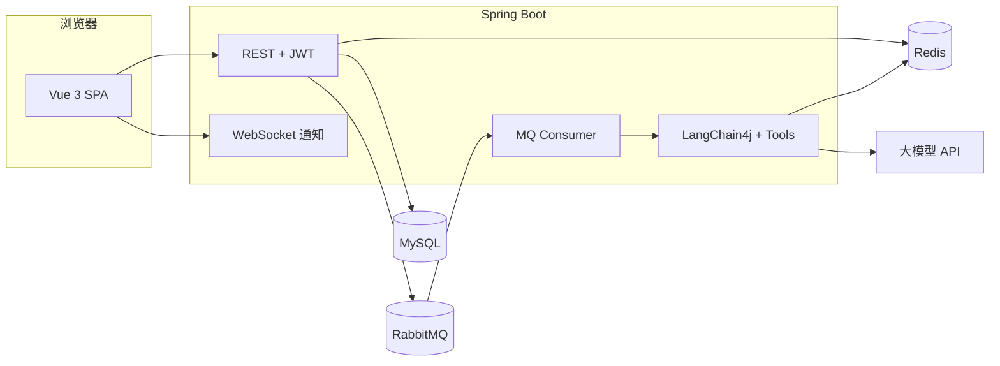

# 网球场在线预约系统 · Tennis Court Booking

前后端分离的 **Java Web** 全栈项目：场地与预约管理、订单与支付流程、**LangChain4j 智能客服**（同步 / 异步队列）、**WebSocket 实时通知**。适合作为个人学习 / 简历项目展示。

---

## 简介

系统面向网球场馆运营场景，支持用户浏览场地、预约时段、管理个人订单；管理员可进行场地与用户管理、处理**取消申请**与**线下付款确认**、查看统计报表。集成 **OpenAI 兼容接口** 的大模型客服，通过 **Tools** 调用真实业务接口，避免编造数据；异步对话经 **RabbitMQ** 削峰，任务状态存 **Redis**；管理员审核结果通过 **WebSocket** 推送给在线用户。

---

## 功能概览

| 模块 | 说明 |
|------|------|
| 用户与认证 | 注册 / 登录、JWT、修改密码、角色（普通用户 / 管理员） |
| 场地 | 场地 CRUD、多级缓存（Caffeine + Redis）减轻读压力；改库后删缓存，失败走统一缓存一致性组件（MQ 补偿重试 + TTL 兜底） |
| 预约与订单 | 创建预约、时间冲突与每日时长校验、订单状态、取消申请、线下支付渠道与付款确认审核 |
| 统计 | 用户维度 / 场地维度预约统计（管理员） |
| AI 客服 | 同步对话、异步任务（MQ + Redis 轮询）、死信与补偿重投、会话记忆 Redis 持久化 |
| 实时通知 | WebSocket：付款确认 / 取消申请审核结果推送给用户 |
| 秒杀优惠券 | Redis 库存 + **Lua** 原子扣减与一人一单，落库券码；管理员发布活动时初始化库存 |

---

## 技术栈

**后端**

- Java 17、Spring Boot 3.2.x  
- Spring Security + JWT  
- MyBatis、MySQL、Druid  
- Redis（Lettuce）、Caffeine  
- RabbitMQ（AI 异步对话、DLX 死信）  
- LangChain4j（OpenAI 兼容 API，如通义千问 DashScope）  
- WebSocket（原生 + 握手鉴权）  
- Hutool、Lombok、Validation  

**前端**

- Vue 3、Vite、Vue Router  
- Element Plus、Axios  
- Marked + DOMPurify（AI 回复 Markdown）、QRCode  

---

## 仓库结构（简要）

```
├── src/main/java/com/tennis_court_booking/   # 后端主代码
│   ├── ai/          # AI 客服、异步任务、Tools、Redis 会话记忆
│   ├── cache/       # 场地多级缓存
│   ├── config/      # Security、Redis、WebSocket 等
│   ├── controller/  # REST API
│   ├── mapper/      # MyBatis Mapper
│   ├── security/    # JWT 过滤器与主体缓存
│   ├── service/     # 业务层
│   └── websocket/   # 预约相关通知推送
├── src/main/resources/
│   ├── application.yml
│   ├── mapper/*.xml
│   └── db/          # 部分迁移 SQL 片段
├── tennis-court-frontend/                    # 前端工程
│   ├── src/api/     # 接口封装
│   ├── src/views/   # 页面
│   └── src/layout/  # 布局（含 AI 悬浮窗、WS 通知连接）
└── docs/            # 补充文档（如 AI 异步、WebSocket 说明）
```

---

## 环境要求

- **JDK** 17+  
- **Maven** 3.8+  
- **Node.js** 18+（前端）  
- **MySQL** 8.x（数据库名示例：`tennisbooking`，需自行导入或执行项目内 SQL）  
- **Redis** 6+  
- **RabbitMQ** 3.x（使用 AI 异步对话时必需）  
- **大模型 API Key**（通义千问等 OpenAI 兼容地址，见下文环境变量）

---

## 快速开始

### 1. 数据库

创建数据库并导入表与初始数据（可参考仓库内 `database_dump.sql`、`docker/mysql/init/00-init.sql` 或自行迁移脚本）。在 `application.yml` 中修改数据源 **URL / 用户名 / 密码**（**切勿将生产密码提交至公开仓库**）。

### 2. 后端配置

编辑 `src/main/resources/application.yml`（或使用 Spring Profile / 环境变量覆盖）：

- `spring.datasource.*`：MySQL  
- `spring.data.redis.*`：Redis  
- `spring.rabbitmq.*`：RabbitMQ  
- `langchain4j.open-ai.chat-model.api-key`：或通过环境变量 **`AI_API_KEY`** 注入  
- `jwt.secret`：生产环境务必更换为强随机密钥  

启动：

```bash
mvn spring-boot:run
# 或
mvn -DskipTests package && java -jar target/springboot-mybatis-quickstart-0.0.1-SNAPSHOT.jar
```

默认 HTTP 端口：**8080**。

### 3. 前端

```bash
cd tennis-court-frontend
npm install
npm run dev
```

开发环境默认 **http://localhost:5173**，通过 Vite 将 `/api` 代理到 `http://localhost:8080`。

**WebSocket**：本地开发时预约通知直连后端 **`ws://127.0.0.1:8080/api/ws/notifications?token=...`**（见 `tennis-court-frontend/src/utils/bookingNotificationWs.js`），避免经 Vite 代理 WebSocket 升级失败。

### 4. AI 异步（可选）

需先启动 **RabbitMQ**。说明与队列设计见：

- `docs/AI_RABBITMQ_ASYNC.md`

### 5. 大模型 Key（可选）

未配置时部分环境可能使用 `application.yml` 中的占位；生产环境请使用：

```bash
export AI_API_KEY=你的Key
```

---

## 主要 API 说明（节选）

| 说明 | 路径前缀 |
|------|-----------|
| 登录 / 注册 | `POST /api/login`、`/api/register` |
| 场地、预约 | `/api/courts`、`/api/bookings` 等 |
| 管理员预约审核 | `/api/admin/bookings/...` |
| 管理员统计 | `/api/admin/stats/...` |
| AI 同步对话 | `POST /api/ai/chat/simple` |
| AI 异步对话 | `POST /api/ai/chat/async`，轮询 `GET /api/ai/chat/task/{taskId}` |
| 预约实时通知 WS | `GET` 升级为 WebSocket：`/api/ws/notifications?token=<JWT>` |

更细的异步与 WebSocket 说明见 **`docs/`** 目录。

---

## 架构示意



---

## 注意事项

1. **密钥与密码**：公开仓库前请删除或脱敏 `application.yml` 中的数据库密码、JWT 密钥、默认 API Key；推荐使用环境变量或私有配置。  
2. **默认管理员**：若项目含数据初始化逻辑，请以实际代码为准修改默认账号密码。  
3. **CORS**：生产环境在 `SecurityConfig` 中配置实际前端域名。  

---

## 文档索引

| 文档 | 内容 |
|------|------|
| `docs/AI_RABBITMQ_ASYNC.md` | AI 异步队列、任务状态、死信与补偿 |
| `docs/WEBSOCKET_BOOKING_NOTIFICATIONS.md` | WebSocket 预约/付款通知 |
| `docs/COUPON_SECKILL.md` | 秒杀优惠券（Redis + Lua） |

---

## License

本项目用于学习与交流。若需开源协议，请自行补充 `LICENSE` 文件。

---

**若本 README 随简历中的 GitHub 链接使用，建议将「项目简介 + 技术栈 + 与你负责模块」在个人简历中再写一版更短的 bullet，与本仓库内容对应即可。**
